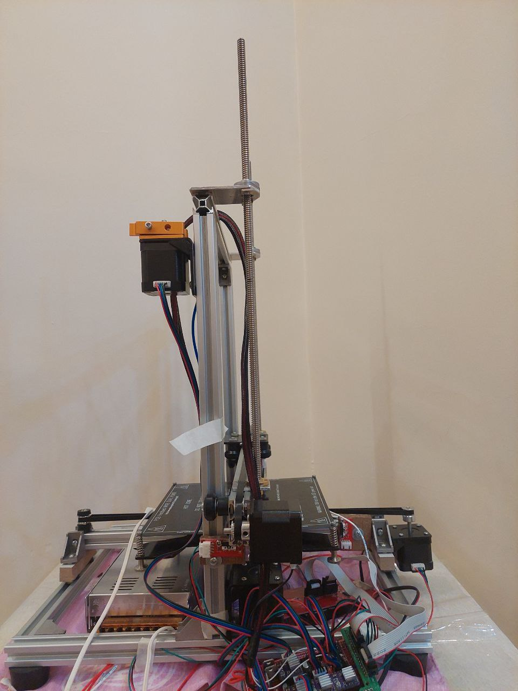

# Custom 3D Printer Development

In this personal project, I designed and built a custom 3D printer entirely from scratch, showcasing my ability to transform technical concepts into a fully functional system using limited resources. This hands-on experience emphasized my skills in mechanical design, electronics integration, and firmware customization, all critical to building real-world robotic demonstrators.

## Key Features

- Integrated stepper motors, microcontrollers, and sensors to achieve precise print control
- Customized Marlin firmware to handle job management and axis calibration
- Iteratively tested designs using Cura, optimizing for print quality and material efficiency
- Documented the complete build process to promote reproducibility and shared learning

## Implementation Result

The image below illustrates the completed custom 3D printer during testing:

## Technical Highlights

This project reinforced my problem-solving abilities and deepened my practical expertise in robotics, control systems, and embedded programming. It served as a foundation for future prototyping and automation projects, where cost-effective, reliable hardware solutions are essential.
