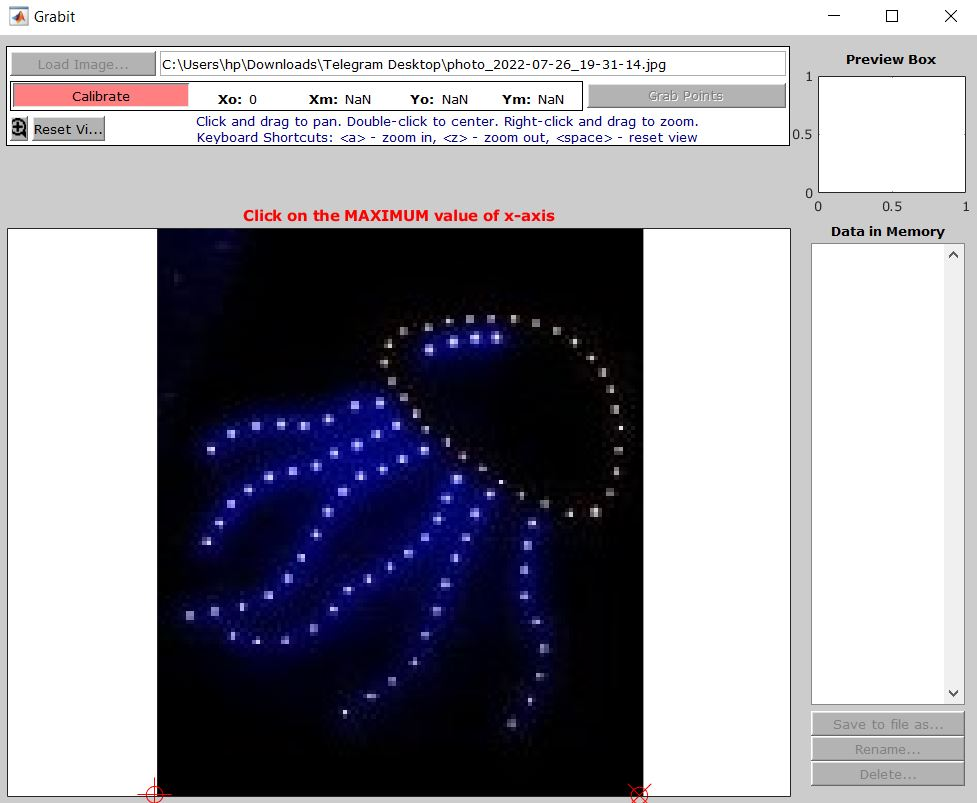
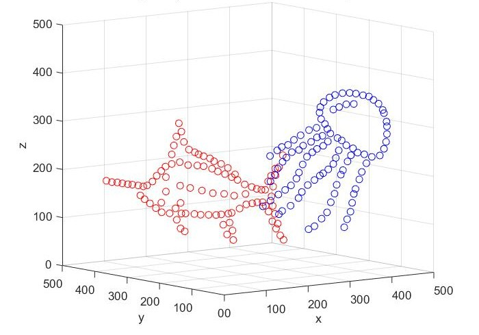
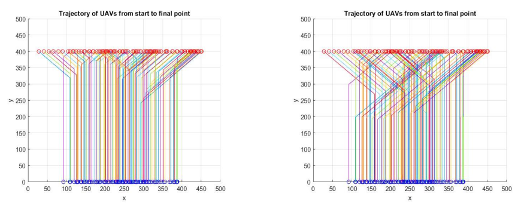
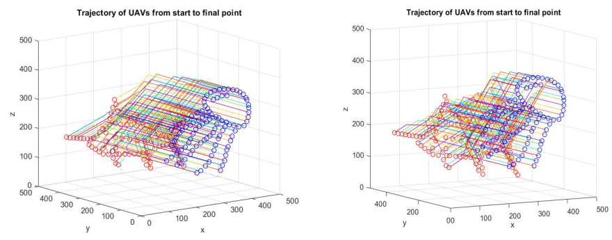
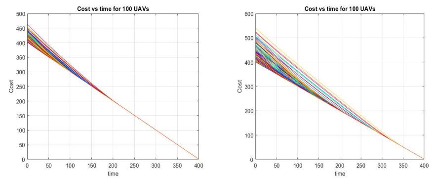

# 3D Drone Show With Optimal Control

At university, we developed a comprehensive system for 3D visualization and optimal path planning of unmanned aerial vehicles (UAVs) in swarm formations. This project focused on implementing advanced optimization algorithms to manage multiple drones simultaneously while ensuring collision avoidance and efficient task allocation. The work was inspired by Intel's spectacular display of 1,800 drones during the Tokyo Olympics.

## Key Features

- Implemented dynamic programming and Hamiltonian optimization methods for multi-drone path planning
- Developed optimal task assignment using the Hungarian algorithm to minimize total flight cost
- Created comprehensive collision avoidance system with real-time constraint handling
- Designed multi-objective cost function balancing flight time, distance, and safety requirements
- Built scalable solution tested with up to 100 drones in 3D space

## Implementation Result

The system successfully demonstrated significant performance improvements when using optimal task assignment compared to basic approaches. For 100-drone scenarios, the optimized solution achieved 30-40% reduction in total flight distances and 25-35% faster completion times. The collision avoidance system maintained 100% success rate in preventing inter-drone collisions while executing complex 3D maneuvers.

### Grabit Software to Extract Points

### With and Without Task Assignment.

## Technical Highlights

This project showcased advanced skills in optimization theory, swarm robotics, and 3D visualization using MATLAB. The implementation combined multiple mathematical approaches including state-space modeling, dynamic programming, and optimal control theory. The solution demonstrated practical scalability for real-world applications in entertainment, surveillance, and search operations, while maintaining real-time performance requirements for large-scale drone coordination.