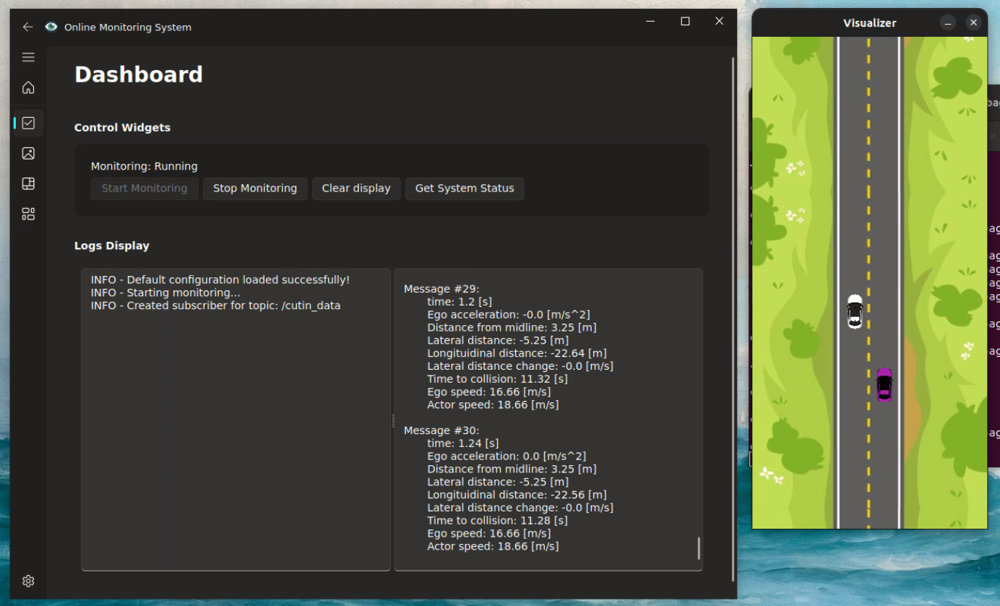

# Custom API and GUI Development

At Argos, I designed and developed a customized API and graphical user interface (GUI) to meet the specific needs of a client in the autonomous vehicle domain. The application focused on streamlining the monitoring process and providing a user-friendly interface to manage various robotic and automation tasks. Using PyQt, I created a professional and responsive GUI integrated with a robust backend system.

## Key Features

- Developed a custom API to manage backend logic and facilitate communication between system components
- Designed a modern desktop GUI using PyQt, with a structured layout including a side menu, dashboard, and configuration panel
- Ensured smooth user experience through intuitive navigation, icon-based menus, and responsive design
- Converted Python codebase to C++ to improve runtime efficiency and prepare for deployment in performance-critical environments

## Implementation Result

The following image displays the graphical interface developed for the monitoring system:

## Technical Highlights

This project highlighted my ability to design full-stack desktop applications tailored to robotic system workflows. It combined strong UI/UX design principles with backend system logic and cross-language performance optimization, resulting in a reliable and scalable solution for real-world deployment.
