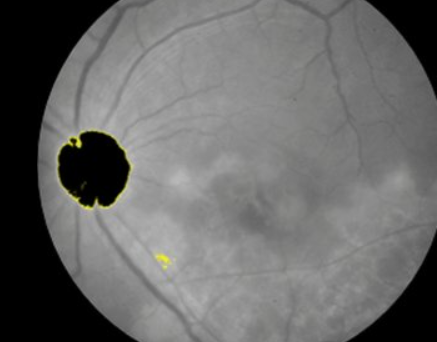

# Lesion Detection in Ocular Imagery using Deep Learning

In this project, I addressed the challenge of lesion detection in ocular images by applying advanced deep learning methods. The goal was to create a system capable of accurately identifying lesions through image classification and segmentation. I utilized popular deep learning frameworks such as TensorFlow and Keras to implement and train the models.

## Key Features

- Preprocessed high-resolution ocular medical images for analysis
- Applied the Albumentations library for advanced data augmentation techniques
- Implemented EfficientNet as a classification backbone to identify lesion presence
- Deployed the U-Net architecture for pixel-level lesion segmentation
- Tuned training parameters and validation processes to optimize performance

## Implementation Results

The following images illustrate the lesion classification and segmentation outcomes:

## Technical Highlights

This project enhanced my expertise in medical image analysis, deep learning architectures, and data preprocessing workflows. The integration of both classification and segmentation pipelines demonstrated a comprehensive approach to lesion detection in ocular imagery, contributing to potential improvements in diagnostic assistance systems.
