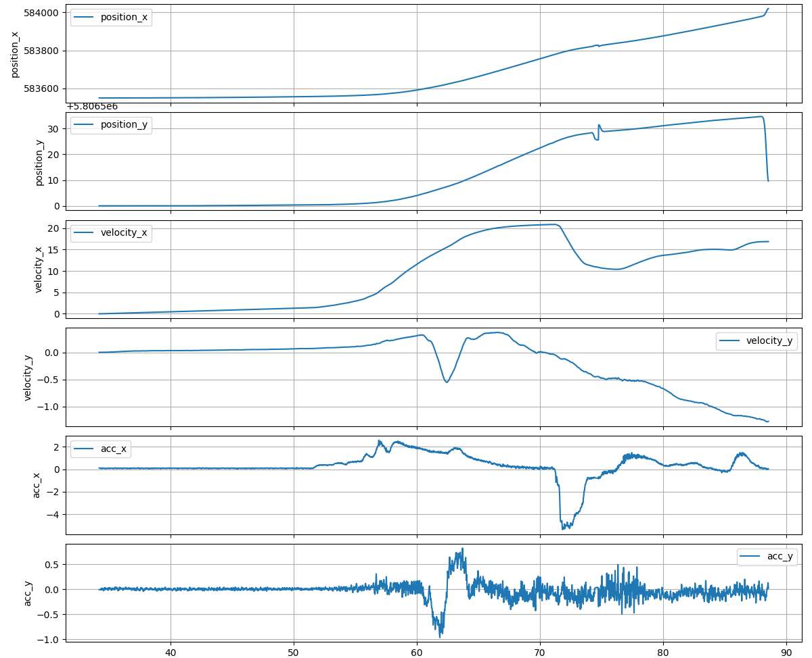
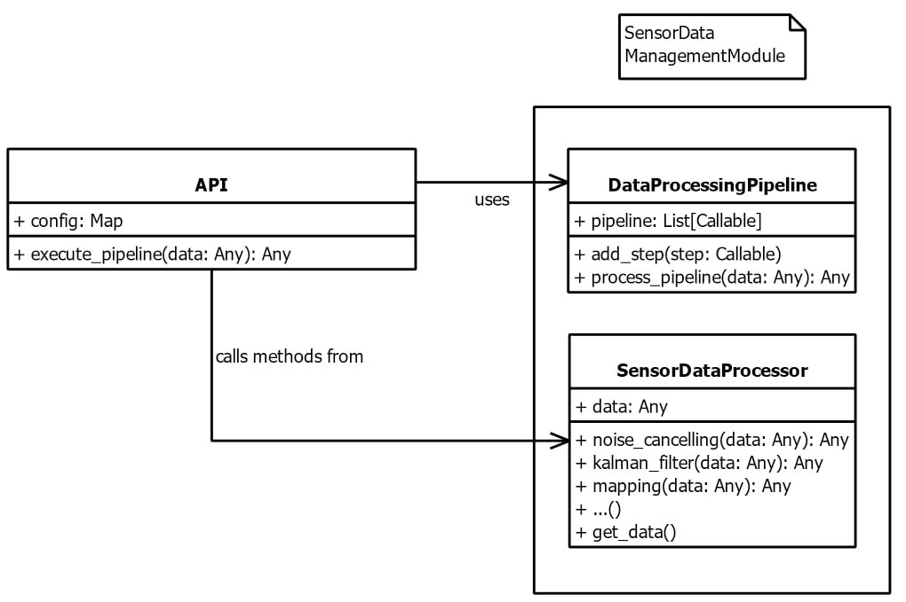

# Noise Reduction for Autonomous Vehicles

At Argos, I led a project to improve the reliability of sensor data used by autonomous vehicles. The goal was to reduce noise in critical signals such as position, acceleration, and velocity to ensure more accurate mapping, object detection, and vehicle monitoring. Through advanced signal processing and real-time filtering techniques, the system became more robust to environmental interference, leading to improved algorithmic performance in simulation environments like ESMINI.

## Key Features

- Designed and implemented filtering algorithms to denoise position, acceleration, and velocity data streams
- Applied techniques such as Kalman filters and low-pass filters to suppress environmental noise
- Validated the effectiveness of algorithms using Esmini, showing increased accuracy under adverse conditions
- Optimized real-time processing with Python, then ported the solutions to C++ for performance-critical deployment
- Documented processes and outcomes, presenting insights that guided design iterations and improvements

## Implementation Results

The following images demonstrate the noise reduction system in simulated testing environments:

## Technical Highlights

This project emphasized the importance of data quality in autonomous systems and showcased my ability to develop real-time, cross-platform filtering solutions. The results significantly enhanced the reliability of downstream monitoring algorithms, especially in noisy or unpredictable driving environments.
