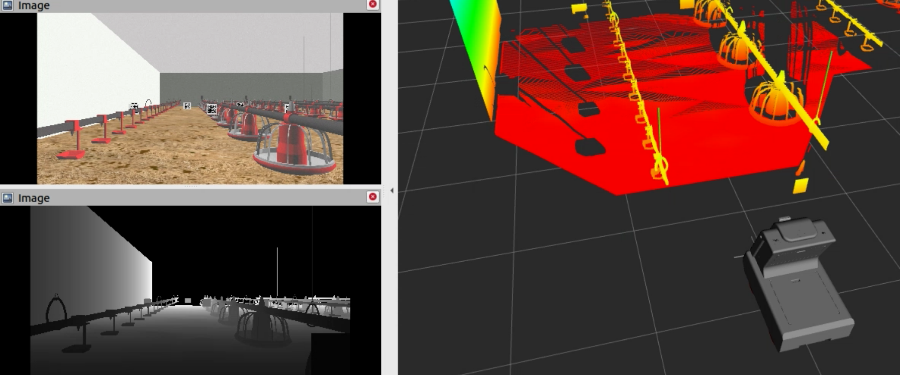
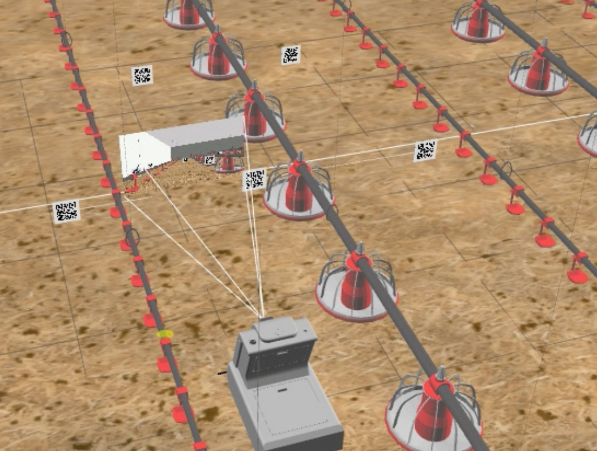
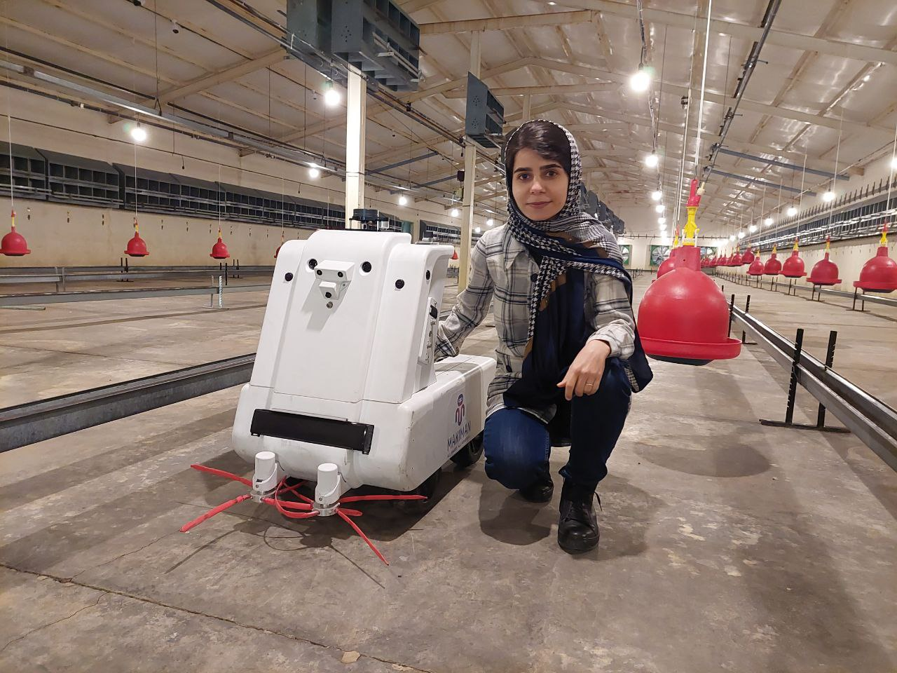

# Poultry Robot Navigation

This project involved the design, simulation, and deployment of an autonomous robot for real-world poultry farm monitoring. As a Robotics Engineer, I played a key role in integrating ROS Noetic's Navigation Stack and Hector SLAM (Simultaneous Localization and Mapping) algorithm for navigation using various sensors like 2D LIDAR, IMU, and wheel odometry.

In the second phase of this project, I enhanced the navigation system by implementing it within ROS 2 Humble and Nav2. For SLAM, I utilized the RTAB-Map algorithm. A RealSense 435i camera provided the necessary visual data for accurate environment mapping and robot localization.

## Key Features

- Integrated ROS Noetic's Navigation Stack and SLAM for navigation using sensor data
- Simulated the robot in Gazebo, replicating the real-world environment for code testing
- Implemented visual SLAM and Nav2 for efficient robot movement within the poultry farm
- Fused sensor data (2D LIDAR and camera) using a Kalman filter for accurate mapping and localization
- Executed various test scenarios to refine robot movement and navigation capabilities

## Implementation Results

The following images showcase the different aspects of the project implementation:

## Technical Challenges

During the development process, we encountered several technical challenges that required innovative solutions. The integration of multiple sensor systems demanded careful calibration and synchronization to ensure accurate data fusion.