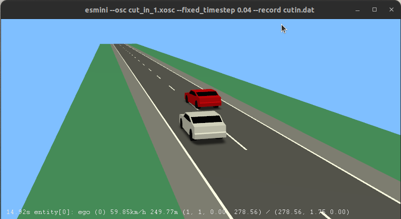

# Scenario Design for Autonomous Vehicle Testing

As a Software Developer at Argos, I designed and implemented simulation scenarios to validate monitoring algorithms for autonomous vehicles. Using OpenSCENARIO, I modeled complex driving conditions and executed them in simulators like CARLA and ESMINI. To improve realism, I developed custom road maps with RoadRunner and linked them to scenario scripts. A YAML-based interface streamlined configuration and collaboration, while custom Python tools handled automated data extraction and performance validation.

## Key Features

- Designed testing scenarios with OpenSCENARIO, simulating realistic driving conditions in CARLA and ESMINI
- Created high-fidelity maps in RoadRunner and integrated them with simulation scenarios
- Developed Python scripts to extract and process simulation data for algorithm evaluation
- Built a YAML-based interface for team-wide configuration, promoting clarity and ease of use
- Validated AV monitoring algorithms by analyzing simulation outputs for accuracy and robustness

## Implementation Result

The following image highlights a custom scenario setup and its execution environment at Esmini:

## Technical Highlights

This project demonstrated my ability to bridge scenario simulation and automated data analysis, enabling scalable and efficient testing of autonomous vehicle systems. It also emphasized the importance of tool interoperability and well-structured interfaces in collaborative development environments.
