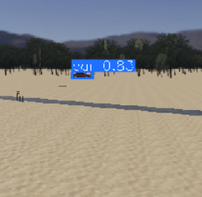
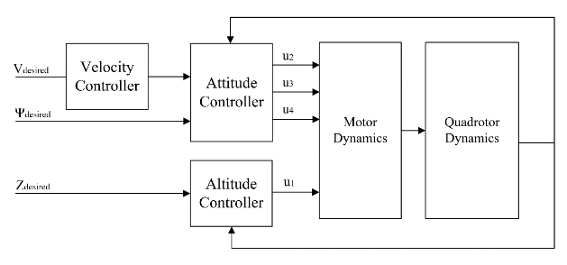

# UAV Control and Navigation with Speech Recognition

This project focused on the development of a voice-controlled unmanned aerial vehicle (UAV) for object tracking within a simulated environment. I utilized my expertise in robotics, machine learning, and programming to build a system that integrates speech recognition and object detection for autonomous navigation.

## Key Features

- Developed a custom speech recognition model using recurrent neural networks
- Fine-tuned OpenAI Whisper for improved speech recognition accuracy
- Used object detection models to identify a variety of objects in simulation
- Enabled UAV voice-controlled guidance to track specific targets
- Implemented control algorithms for smooth and precise UAV motion
- Used Webots as the primary simulation environment
- Connected all components using ROS 2 for synchronized execution
- Integrated RGB and depth cameras for object detection and distance estimation
- Enhanced detection capabilities with various computer vision libraries

## Implementation Results

The following diagrams and images showcase key elements of the project:

## Technical Highlights

The project successfully demonstrates the integration of modern machine learning models and robotic control systems in a simulated UAV platform. Using voice commands to drive object-aware navigation highlights new possibilities in hands-free UAV operation. This project lays a foundation for future work in real-world autonomous drone applications.
